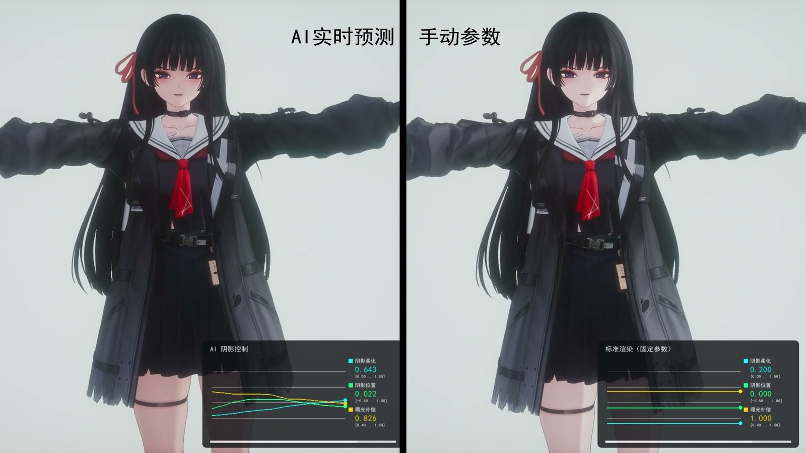
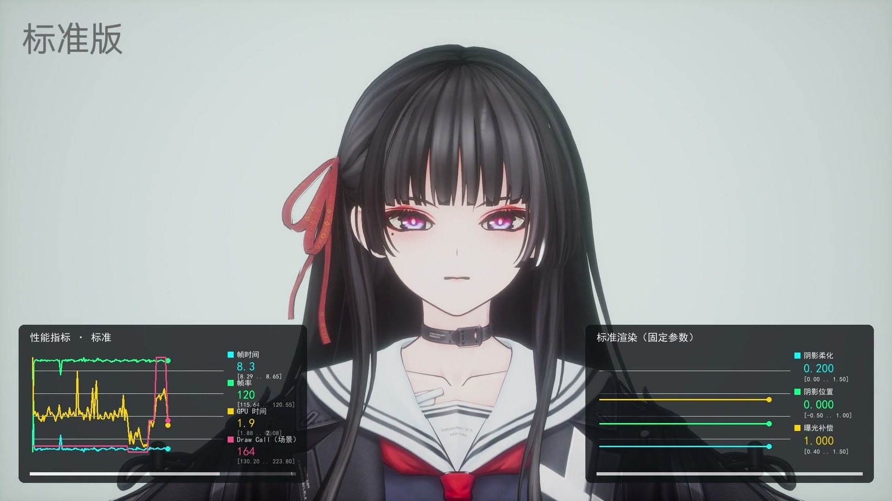

# SEIKAI — MMD Toon Shader for UE5

把 MMD 风格卡通渲染整套装进 **一个 UE5 Custom 节点**：输出接 Emissive，完全脱离引擎光照系统，所有明暗关系自己算，美术参数全开放。

> An MMD-style toon rendering solution for Unreal Engine 5 — the entire shader lives in a single Custom node, with an optional embedded MLP that auto-calibrates shadow parameters from light direction.

*左：MLP 按光照方向实时预测阴影柔化 / 阴影位置 / 曝光补偿。右：同一机位的固定手动参数。*

## 功能一览

**角色着色器** — `Latest_Development/Character/`
- Toon 阴影：三层色带 / 曲线图集（CurveLinearColorAtlas）/ Ramp 贴图多条路径，HSV 统一阴影调色
- Rim Light：镜头 + 光源 + 法线三方向，条带宽度与边缘软硬解耦
- Matcap：双贴图（高光 + 粗糙），自适应球面映射，含相机越顶跳变消除
- 头发高光：贴图定位 / Kajiya-Kay 各向异性两种模式
- 法线贴图（可选）：BC5 只读 RG 重建 Z，切线无效 / 蓝通道双守卫自动回退
- 色调三模式（Overlay / 乘法 / Soft-Light）、饱和度、曝光、SSS、HM 贴图 AO
- 变体：Alpha 半透明版、头发边缘版、Full 整合版、配件增强版、功能最全版

**AI 阴影自动校准** — `Latest_Development/AI/`
- 内嵌 3→64→3 MLP：由光照方向实时预测阴影柔度 / 阴影位置 / 曝光，代替逐镜头手工校准
- 权重训练后固化为 HLSL 常量，运行时零依赖（不需要 ONNX / PyTorch）
- Python 训练管线：锚点表 → 拍摄偏置扣除 / 球谐光滑标签 → MLP 拟合 → 自动写回 shader
- UE 编辑器插件 `UE_MMDAnchorRecorder`：从 Level Sequence 批量录制校准锚点

**建筑着色器** — `Latest_Development/Architecture/`
- Unlit 版：连续渐变阴影 + ORM 贴图 + 窗户/灯笼自发光
- Lit 版：表面色留在 Custom 节点、受光交回 Default Lit 管线，可接收角色/道具的动态投影

**描边** — `Latest_Development/Outline/`
- Post Process 抗抖动版：Vogel 盘覆盖率亚像素抗锯齿（推荐）
- Inverted Hull 版：吃引擎原生 TAA / MSAA；另有早期八方向阈值判边版

**其他**：雨滴材质（`Effects/`）、法线贴图 bug 复现工具（`Debug/`）、MMD 骨骼名日英对照表（根目录 `MMD_Bone_Name_Dict_EN.csv`）

*标准渲染版（固定参数）+ UE 性能监视器：GPU 用时 1.9 ms、Draw Call 164（R5 9600X + RTX 5070 / 1080p / UE 5.8）*

## AI 阴影校准：为什么神经网络比手工校参更稳

用 MLP 替代手工校参，收益不在"省事"，而在**消除光源移动时的阴影边界抖动**。

问题症状：光源沿 Level Sequence 扫过时，阴影边界逐帧跳。沿 5 条光扫轨迹实测，边界位移 >0.5°/帧 的帧占 **14.2%**，P99 达 1.7°、最大 8.3°。

根因有两层，都排查过：

1. **标签本身矛盾** —— 锚点是 5 条甩拍各自手工校的。相近光向下 `ShadowSmooth` 分歧最大 0.64，每条拍摄还带系统性偏置。IDW 精确穿过每个锚点，就等于把这份矛盾变成了目标场上的"脊"。
2. **容量过拟合** —— 网络把这些脊也学了进去。容量扫描（同一份标签，只改隐藏层宽度）：

| 隐藏层 | 16 | 24 | 64 | 256 |
|---|---|---|---|---|
| 边界抖 >0.5°/帧 | 1.3% | 5.0% | 12.7% | **14.2%** |

**R² 越高反而抖得越厉害** —— 因为 R² 是在给矛盾打分。容量越大，越忠实地拟合标签噪声。

处置：先扣掉每条拍摄的系统性偏置，再用 **3 阶球谐最小二乘**拟合全局光滑场当标签，隐藏层从 256 降回 64。

| 指标 | 旧（IDW + H=256） | 新（球谐光滑 + H=64） |
|---|---|---|
| 边界抖 >0.5°/帧 | 14.2% | **0.00%** |
| 边界抖 >1.0°/帧 | 6.8% | **0.00%** |
| P95 / P99 | 0.88° / 1.71° | **0.18° / 0.31°** |

代价与边界（写在文档里，不藏）：

- 光滑场不再精确穿过锚点，15/75 行残差 >0.3（残差中位 0.149）。要保留美术刻意推的极值，得回到 IDW 口径。
- 光滑**阶数必须低**，4 阶以上出现龙格震荡，抖动反而回升到 20~36%。
- 相机运动是**独立**的第二条抖动通路，训练侧改不掉：相机每转 1°，边界中位移 0.12°、P95 0.76°。

完整推导与实验记录见 [`Latest_Development/Documentation/MMDToonShader_Full_AI_使用文档.md`](Latest_Development/Documentation/MMDToonShader_Full_AI_使用文档.md) §9.5。

## 快速开始

1. 新建材质，Shading Model = **Unlit**
2. 添加 Custom 节点，把对应 `.hlsl` 全文粘进 Code 字段，Output Type = `CMOT Float3`
3. 按文件头部注释的 Inputs 列表逐条添加引脚（名称区分大小写）
4. 输出接 **Emissive Color**；贴图一律用 `TextureObjectParameter` 传入

各变体的专属设置（建筑 Lit 版的双节点接法、描边的前置 CVar 与参数表、AI 版的锚点录制与重训流程）见下方文档。

## 文档

| 文档 | 内容 |
|---|---|
| [`Latest_Development/INDEX.md`](Latest_Development/INDEX.md) | 源码树索引：每个文件是什么、怎么选 |
| [`MMDToonShader_SM5_SingleFunc_Full_使用文档.md`](MMDToonShader_SM5_SingleFunc_Full_使用文档.md) | Full 整合版详细说明 |
| [`Latest_Development/Documentation/MMDToonShader_SM5_SingleFunc_使用文档.md`](Latest_Development/Documentation/MMDToonShader_SM5_SingleFunc_使用文档.md) | SingleFunc 主文件完整参数手册、材质图连接、故障排查 |
| [`Latest_Development/AI/README.md`](Latest_Development/AI/README.md) | AI 版使用说明与训练管线 |
| [`Latest_Development/Documentation/`](Latest_Development/Documentation/) | Shader 原理、MLP 演进、训练数据逻辑、性能测试计划等 |

## 环境

- UE 5.x（Shader Model 5），着色器本体无需任何插件
- AI 重训管线：Python 3 + scikit-learn / numpy
